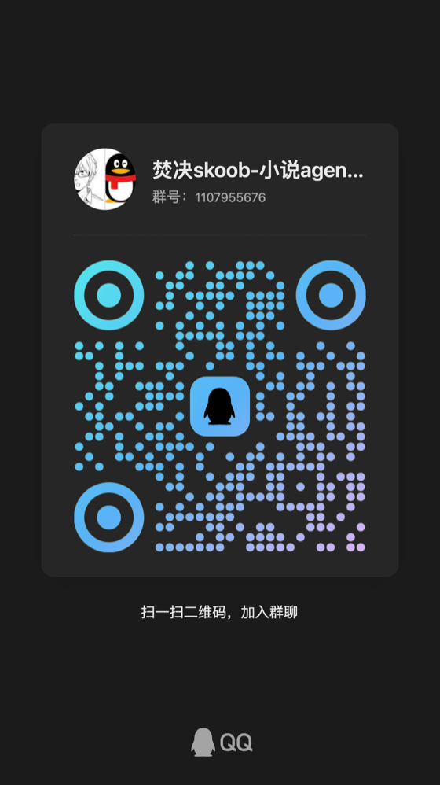

<div align="center">

# 焚诀 Skoob · Burn Art

**AI 网文创作工作室 —— 让每一个灵感都能长成一本书**

[官网 skoob.cc](https://skoob.cc) · [能力总览](#能力总览) · [本地 vs 云端](#本地-vs-云端) · [API 文档](https://skoob.cc/site/docs/api) · [安装](#快速开始) · [商用授权](#许可证与商用授权)

</div>

---

焚诀 Skoob 是一个面向长篇与连载网文的 AI 创作智能体：把一句话灵感，经由**六步创作编排**与**多智能体仿真推演**，长成有世界观、有角色弧光、有卷册节奏的完整小说。
围绕作者最常遇到的卡文、AI 味、拆书与写书问题，把灵感、知识积累和正文创作连接起来。一本书留下的不只是正文，还有世界规则、实体关系与可参考的设定档案。

本项目定位为 **Open-Skoob 个人本地部署版**：前端与基础后端公开，用户可自行部署、修改页面，使用自己的模型 Key 完成基础创作；天王、天衍、天魔、天工四大核心引擎通过可选的官方云端 API 提供，实现源码不随本项目发布。

> **下载即可搭建自己的创作工作室：** 本仓库包含当前网页和可独立运行的本地后端。配置自己的模型后，可以对话、生成意图卡、逐步确认大纲与正文、管理作品并导出；无需先购买官方引擎。四大引擎作为可选云端能力单独连接。

## 能力总览

### 可选的官方云端引擎

| 引擎 | 说明 | 核心特性 |
|---|---|---|
| **天王拆书** `TIANWANG` | 逆向拆解爆款：八位师傅流水线与质量验收，把一本书拆成可检索的知识图谱与创作资产 | 章节级全文索引 · 向量+全文混合检索 · 逆向大纲与证据片段 · 可复用模板 Skill |
| **天衍世界模拟** `TIANYAN` | 多轮仿真推演剧情走向：角色信念、势力博弈、事件连锁全程可追，开写前先看见结局的代价 | 小说本体生成 · 实体关系建图 · 角色画像与信念轨迹 · 多轮剧情仿真 |
| **天魔热榜** `TIANMO` | 多平台热点聚合蒸馏：从趋势里找下一个选题，热点信号当天变成可开写的剧情种子 | 多源信号采集 · 趋势聚类 · 方向 Skill 适配 · 剧情种子生成 |
| **天工创作工具** `TIANGONG` | 为故事生成画面、制作小说封面，检测文本中的 AI 味并辅助改写，打磨文字表达 | AI 生图 · 小说封面 · AI 检测 · 文本改写 |

### 创作流水线

**六步创作**：意图卡 → 世界观 → 书名与简介 → 全书大纲 → 卷与循环 → 章节正文

人物、地点、势力、器物与世界规则的设定档案贯穿创作。快速直出保留基础创作流程；需要更深入的剧情推演时，再调用天衍云端仿真。

**一章的写书六师接力**：

```
规划师(CHAPTER MEMO) → 编排师(CONTEXT PACKAGE) → 执笔师(CHAPTER DRAFT)
→ 审校师(AUDIT REPORT) → 修订师(REVISED DRAFT) → 结算师(TRUTH STATE)
```

**拆书八师逆流程**：

```
入库师(SOURCE MANIFEST) → 测绘师(BOOK INDEX) → 开卷师(OPENING PROFILE)
→ 本体师(GRAPH SKELETON) → 纪事师(CHAPTER CARDS) → 脉络师(REVERSE OUTLINE)
→ 设定师(AGENT PROFILES) → 验收师(QUALITY GATES)
```

### 创作模式

| 模式 | 体验 |
|---|---|
| **引导模式** | 从意图卡到正文逐步确认，每个关键决策都有你在场 |
| **剧场模式** | 通过对话观察、参与和调整故事，跟着你的思路推进 |
| **互动影游** | 以分支体验参与故事，探索不同选择带来的走向 |

全自动是减少逐步确认的运行策略，仍保留校验。以上为 Skoob 产品能力介绍，各模式在本地版的开放范围以实际发布版本为准。详细说明见 [产品手册](https://skoob.cc/site/docs/product-manual)。

## 本地 vs 云端

Open-Skoob 采用**本地基础应用 + 官方云端引擎**的方向：基础后端、作品管理、模型接入与基础创作在用户自己的环境中运行；需要更强的分析、知识、仿真与创作工具时，按需接入官方服务。

官方脑洞、热点和模板列表在连接有效官方 Key 后，按 **Free 免费套餐的实际权益** 展示；高级引擎按具体套餐权益提供，用户按需要选择。自有模型的费用由用户与模型服务商结算；选择官方中转站的付费模型，模型 Token 用量由中转站计量和结算；标注「本机直连」的免费模型直接连接上游。使用自己的模型，不重复向 Skoob 支付这部分模型 Token 费用。

自部署版的能力划分如下：

| 能力 | 本地自部署 | 官方云端升级 |
|---|---|---|
| 网页与基础后端、作品和文件管理 | 公开并可修改 | 可直接使用官方托管产品 |
| 模型配置与基础创作流程 | 使用自己的模型 Key，也可选官方中转站 | 按需选择官方服务 |
| 天衍仿真推演 | 保留调用入口，不包含引擎实现 | 官方 API 提供 |
| 天魔热点、扫榜与脑洞 | 保留调用入口，不包含引擎实现 | 官方 API 提供 |
| 天王拆书、模板与设定知识 | 保留调用入口，不包含引擎实现 | 官方 API 提供 |
| 天工生图、封面、检测与改写 | 保留调用入口，不包含引擎实现 | 官方服务提供，开放 API 范围以文档为准 |

### 把 Skoob 的能力接入你的产品

你可以先从本地版使用基础创作，在需要四大引擎时接入官方云端；也可以为自己的应用、创作工具或工作室洽谈引擎 API 服务。

开放平台计划提供七项首批能力：**天魔扫榜、脑洞、热点；天工 AI 检测；天衍仿真模拟；天王模板、设定**。正式开放范围、接口版本、价格与授权以开通资料为准，不把官网内部接口直接当作已交付的商户 API。

- [体验 Skoob](https://skoob.cc)：了解完整产品与官方服务。
- [API 文档](https://skoob.cc/site/docs/api)：了解接口与能力说明；商用接入需另行确认可用版本。
- API 接入与商业合作：[1651055684@qq.com](mailto:1651055684@qq.com)。

## 快速开始

推荐 **Node.js 24 LTS**（最低 22.13）和 npm。一个命令同时启动网页与本地 API，SQLite 数据库自动初始化：

```bash
git clone https://github.com/OmMaBaMiHong/open-skoob.git
cd open-skoob
npm ci
npm run dev
```

1. 打开 `http://127.0.0.1:9002`，直接填写官方 API Key，或选择「官方账号授权登录」，无需本地访问密码。
2. 没有 Key？点击醒目的「前往官方领取 Free Key」，在 [中转站密钥页](https://gaotk.com/keys) 创建 `openskoob-free` 分组的 Key，回来粘贴并验证。已有有效官方 Key 可直接使用；授权登录后也可明确选择已有 Free Key。验证后，首页按当前 Free 权益展示真实官方脑洞、热点及模板。云端逐项校验 `brainstorm.read`、`hotboard.read`、`templates.read`、`models.use`，不是仅在页面隐藏按钮；官网匿名预览保持开放。
   也可选择「暂不连接，使用自己的模型」，在「设置 → 模型配置」添加自己的 OpenAI 兼容服务；本地基础创作不要求购买套餐。
3. 在首页输入灵感，点「以此灵感开始六步创作」。确认意图卡后，按步骤生成、确认或重写，正文保存到本地作品库。普通问题可直接点「发送」进行对话。
4. 点顶部「官方连接与 Key」可管理接入。直接填 Key 可查看官方免费列表；授权登录还能连接官方账号、同步套餐和上传模板。Free Key 不等于付费会员，四大引擎仍由官方实时校验权益；接入 Key 不会覆盖自己的服务或自动切换模型。
5. 在连接面板中选择本地智能体模板或技能，点「上传到云端」保存到自己的官方账号；需要分享时再点「提交公开审核」。只有云端确认资产入库后才显示上传成功。

授权登录需要官网配套的连接页和交接接口部署完成；若官方服务提示接口尚未部署，可使用已支持的平台凭证方式。普通中转站模型 Key 不自动获得四大引擎权限。

**部署运行：**

```bash
npm run build
npm start
```

**Docker 部署：**

```bash
docker compose up --build -d
docker compose logs skoob
```

Docker 数据保存在 `skoob-data` 卷，默认仅开放本机 `9002` 端口。启动不需要密码，同一实例共享一份本地工作区。远程部署请在 HTTPS 反向代理配置访问控制，并设置 `SKOOB_ALLOWED_ORIGINS` 为实际访问源地址。

本机安装的数据默认位于 `data/`，包含作品、会话、配置和加密凭证；备份时停止服务并完整备份该目录，保留其中的 `secrets.key`。不要上传数据目录或 `.env`。

本地附件支持 UTF-8 文本、Markdown、JSON 和 CSV；二进制文档请先转换为文本。剧场自建群使用所选模型参与讨论，影游文字分支生成后可反复游玩。官方仿真、拆书、热点、检测和生图的实际可用范围由云端授权决定，详见 [接入说明](docs/api-integration.md)。

## 赞助商

| 赞助商 | 说明 | 链接 |
|---|---|---|
| **Gaotk · OpenSkoob 中转站** | 官方推荐的大模型 API 中转站：一个 Key 接入多种模型，Skoob 模型配置中可选择官方中转站与已有 Key；具体模型、价格及活动额度以中转站页面为准 | [gaotk.com](https://gaotk.com) |

> 想成为赞助商？联系 [1651055684@qq.com](mailto:1651055684@qq.com)。

## 许可证与商用授权

本项目采用 **PolyForm Noncommercial 1.0.0（非商业使用许可）**；商业用途须另行购买书面商业授权：

- ✅ 免费：许可证允许的非商业使用，包括学习、研究、个人非商业部署与修改。
- 💼 商业使用：以商业目的使用本软件，包括对外提供产品／服务、集成进商业产品、托管或转售，**必须付费取得作者的书面商业授权**。
- 本版本没有到期自动转为免费商用许可证的安排。

商业授权联系：[1651055684@qq.com](mailto:1651055684@qq.com)。完整协议文本见 [LICENSE](LICENSE)，商业授权方式见 [商业授权说明](COMMERCIAL-LICENSE.md)。源码商业授权、官方引擎 API 服务和模型用量分别约定，购买其中一项不自动获得另外两项的授权或额度。

---

## 赞助与交流

如果这个项目对你有帮助，欢迎请作者喝杯奶茶 ☕（微信支付）

<p>
  
</p>

### 交流群

QQ 群：**1107955676**（焚决 skoob · 小说 Agent 创作群）

<p>
  
  
</p>

### Free 模型权益

官方模型统一使用「OpenSkoob 中转站」入口。先领取并验证自己的 Key，再加载该 Key 获授权的模型；项目不内置公共 Key 或免费模型目录。Free 套餐的 `models.use` 控制官方目录接入，模型调用前再次核验权益和模型权限。标注「Free · 本机直连」的模型，还须通过上游实时零价格目录核验，由本地后端直接请求 Kilo，不经过我们的代理池或中转站推理，不发送官方 Key；免费额度和限流由上游按出口 IP 决定。部署在自己电脑上使用本机出口，部署在 VPS 上则使用 VPS 出口。付费模型仍按中转站计费。自带服务商和本地模型不依赖官方 Free 权益。

旧版自动创建的「Skoob 官方 / OpenSkoob Free」配置会在凭据相同时合并到官方入口，保留原模型选择与加密恢复记录；不同 Key 不会被静默覆盖。
