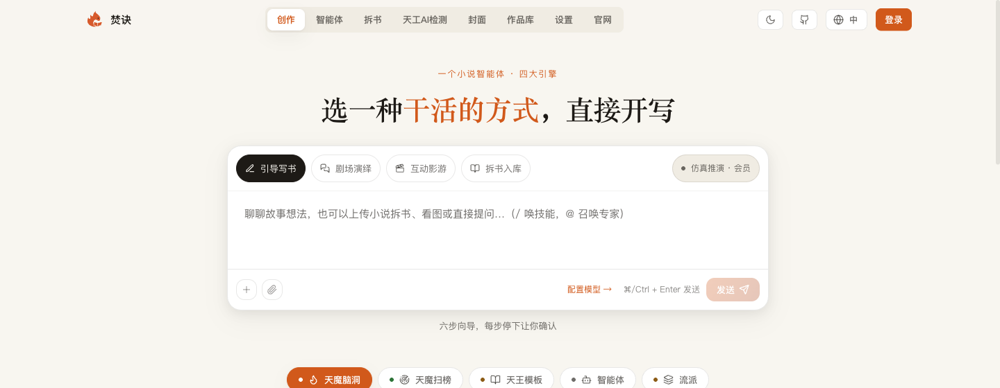
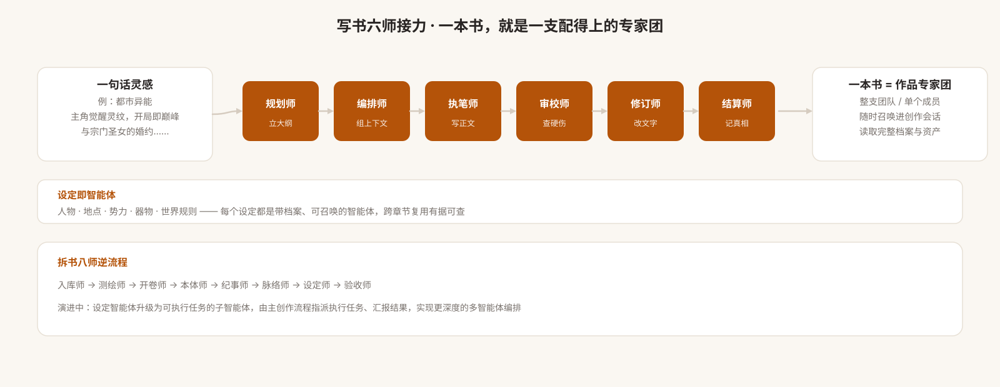
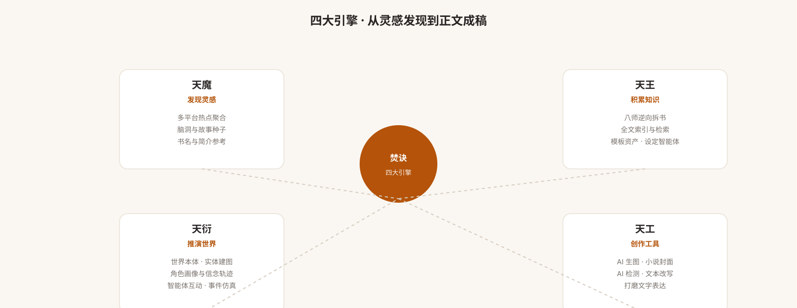
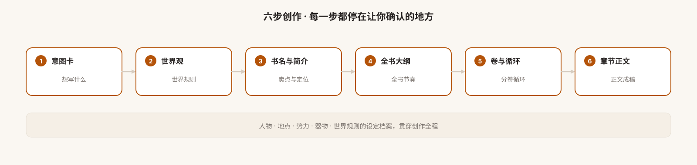
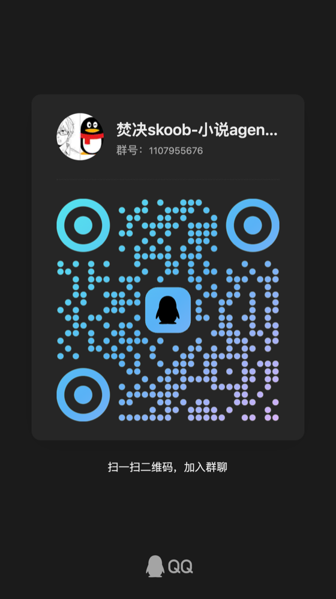

## 这是什么

焚诀 Skoob 是一个面向长篇与连载网文的 **AI 多智能体创作工作室**。它不是让一个 AI 从头编到尾，而是让一队各有分工的智能体，像专业编辑部一样接力创作：规划、执笔、审校、修订，每一环都有专门的智能体负责、校验与交接。

围绕作者最常遇到的**卡文、AI 味、拆书与写书**问题，把灵感、知识积累和正文创作连接起来。一本书留下的不只是正文，还有世界规则、实体关系与可参考的设定档案。

这个仓库是它的**完整创作工作台**：前端、可独立运行的本地后端、六步创作流水线与多智能体编排。配置自己的模型后即可开始创作，四大引擎通过官方云端 API 持续提供完整能力。

## 为什么开源

焚诀相信，写书这件事不该是让一个 AI 从头编到尾。把一句话灵感交给一队各有分工的智能体，像专业编辑部一样接力 —— 这是 Skoob 从一开始就坚持的方式。

这个仓库是 Skoob 的**完整创作工作台**：前端、本地后端、六步创作流水线全部公开。开源是想让每个写作者都能亲手搭建自己的创作工作室 —— 代码是你的，页面是你的，模型 Key 也是你的；四大引擎通过官方云端 API 持续提供完整能力。

对开发者来说，这里还有一套**多智能体创作编排**：写书六师、拆书八师、设定即智能体，值得拆开看看。

## 多智能体协作创作

> 一本书，就是一支配得上的专家团。

焚诀不是让一个 AI 从头编到尾，而是让一队各有分工的智能体像专业编辑部一样接力创作。**每一本书都有自己的创作团队，每一个设定都有自己的档案身份。**

<picture>
  <source media="(prefers-color-scheme: dark)" srcset="docs/assets/agents-dark.svg">
  
</picture>


* **设定即智能体。** 创作或拆解一本书时，每一个人物、地点、势力、器物、能力与世界规则，都会成为带档案的智能体 —— 拥有稳定标识、类别、定义、来源与作品关系。角色不是提示词里的一段描述，而是书里持续存在、可被随时召唤的知识实体；跨章节、跨作品复用时有据可查、有源可溯。

* **作品专家团。** 一本书完成创作或拆解后，会沉淀为这本书的专家团：整支团队或单个成员都可以被召唤进创作会话，读取完整档案与沉淀资产。写作时六师接力（规划师 → 编排师 → 执笔师 → 审校师 → 修订师 → 结算师），拆书时八师逆流程（入库师 → 测绘师 → 开卷师 → 本体师 → 纪事师 → 脉络师 → 设定师 → 验收师），每个环节都由专门智能体负责、校验与交接。

* **向子智能体执行演进。** 基础设定智能体已随版本落地；正在开发的是把设定智能体升级为**可执行任务的子智能体** —— 由主创作流程指派具体角色智能体去执行任务、汇报结果，实现更深度的多智能体编排（对标通用 Agent 框架的子代理 / 委派模式）。这是 Skoob 区别于 "单提示词生成" 的关键能力，也是下一阶段的主线。

## 四大引擎

<picture>
  <source media="(prefers-color-scheme: dark)" srcset="docs/assets/engines-dark.svg">
  
</picture>

| 引擎                | 定位   | 提供什么能力                                 |
| ----------------- | ---- | -------------------------------------- |
| **天魔** `TIANMO`   | 发现灵感 | 多平台热点聚合与趋势聚类・脑洞与故事种子・书名与简介参考           |
| **天王** `TIANWANG` | 积累知识 | 八师逆向拆书・章节级全文索引与知识检索・模板与风格资产・策略路由・设定智能体 |
| **天衍** `TIANYAN`  | 推演世界 | 世界本体与实体关系建图・角色画像与信念轨迹・智能体互动与多轮事件仿真     |
| **天工** `TIANGONG` | 创作工具 | AI 生图与小说封面・AI 检测・文本改写                  |

## 创作流水线

**六步创作**：意图卡 → 世界观 → 书名与简介 → 全书大纲 → 卷与循环 → 章节正文

人物、地点、势力、器物与世界规则的设定档案贯穿创作全程。快速直出保留基础创作流程；需要更深入的剧情推演时，再调用天衍仿真。

<picture>
  <source media="(prefers-color-scheme: dark)" srcset="docs/assets/pipeline-dark.svg">
  
</picture>

**一章的写书六师接力**：


```
规划师(CHAPTER MEMO) → 编排师(CONTEXT PACKAGE) → 执笔师(CHAPTER DRAFT)
→ 审校师(AUDIT REPORT) → 修订师(REVISED DRAFT) → 结算师(TRUTH STATE)
```

**拆书八师逆流程**：


```
入库师(SOURCE MANIFEST) → 测绘师(BOOK INDEX) → 开卷师(OPENING PROFILE)
→ 本体师(GRAPH SKELETON) → 纪事师(CHAPTER CARDS) → 脉络师(REVERSE OUTLINE)
→ 设定师(AGENT PROFILES) → 验收师(QUALITY GATES)
```

## 看一眼


## 你会得到什么


|                 |                                                                                                |
| --------------- | ---------------------------------------------------------------------------------------------- |
| **三种创作模式**      | 引导模式从意图卡到正文逐步确认，每个关键决策都有你在场；剧场模式通过对话观察、参与和调整故事；互动影游以分支体验参与故事，探索不同选择带来的走向。全自动是减少逐步确认的运行策略，仍保留校验 |
| **作品与设定档案**     | 一本书沉淀出世界规则、实体关系与角色档案，跨章节、跨作品复用时有据可查、有源可溯                                                       |
| **本地创作工作台**     | 网页与本地后端完整公开，作品、会话、配置存本地，用自己的模型 Key 即可完成从灵感、大纲到正文的完整创作                                          |
| **官方 Free Key** | 领取官方 Key 即可体验免费的 Token 与云端能力；四大引擎由官方实时校验权益                                                     |
| **桌面客户端**       | Tauri 2 封装的 Windows /macOS 客户端，无需安装 Node 或 Docker                                              |
| **开放 API**      | 首批开放：天魔扫榜、脑洞、热点；天工 AI 检测；天衍仿真模拟；天王模板、设定                                                        |

## 跑起来

推荐 **Node.js 24 LTS**（最低 22.13）和 npm。一个命令同时启动网页与本地 API，SQLite 数据库自动初始化：


```
git clone https://github.com/OmMaBaMiHong/open-skoob.git
cd open-skoob
npm ci
npm run dev
```

打开 `http://127.0.0.1:9002`：


1. **连官方 Key（推荐，最快体验）**：直接填写官方 API Key，或选择「官方账号授权登录」，无需本地访问密码。没有 Key？点击「前往官方领取 Free Key」，在 [中转站密钥页](https://gaotk.com/keys) 创建 `openskoob-free` 分组的 Key，回来粘贴并验证。验证后首页按当前 Free 权益展示真实官方脑洞、热点及模板。

2. **用自己的模型**：在「设置 → 模型配置」添加 OpenAI 兼容服务，本地基础创作不要求购买套餐。

3. **开始写**：首页输入灵感，点「以此灵感开始六步创作」。确认意图卡后，按步骤生成、确认或重写，正文保存到本地作品库。普通问题可直接点「发送」进行对话。

点顶部「官方连接与 Key」可管理接入；在连接面板中可以把本地智能体模板或技能「上传到云端」保存到自己的官方账号。Free Key 不等于付费会员，四大引擎仍由官方实时校验权益；接入 Key 不会覆盖自己的服务或自动切换模型。

**部署运行：**


```
npm run build
npm start
```

**Docker 部署：**


```
docker compose up --build -d
docker compose logs skoob
```

Docker 数据保存在 `skoob-data` 卷，默认仅开放本机 `9002` 端口，启动不需要密码。远程部署请在 HTTPS 反向代理配置访问控制，并设置 `SKOOB_ALLOWED_ORIGINS` 为实际访问源地址。

本机安装的数据默认位于 `data/`，包含作品、会话、配置和加密凭证；备份时停止服务并完整备份该目录，保留其中的 `secrets.key`。不要上传数据目录或 `.env`。本地附件支持 UTF-8 文本、Markdown、JSON 和 CSV；二进制文档请先转换为文本。

**桌面客户端**：直接安装 [Windows /macOS 客户端测试版](https://github.com/OmMaBaMiHong/open-skoob/releases/tag/desktop-v0.1.0-beta.1)（Apple Silicon 和 Intel Mac 分别选择对应安装包）。运行时随安装包提供，不需要安装 Node 或 Docker；作品和配置保存在系统应用数据目录，升级安装包不会覆盖本地作品。开发者安装 [Tauri 构建环境](https://v2.tauri.app/start/prerequisites/) 后运行 `npm ci`、`npm run desktop:build`。

**官方模型与 Free 权益**：官方模型统一使用「OpenSkoob 中转站」入口，先领取并验证自己的 Key，再加载该 Key 获授权的模型；项目不内置公共 Key 或免费模型目录。标注「Free・本机直连」的模型由本地后端直接请求上游，不经过代理池或中转站推理，不发送官方 Key；免费额度和限流由上游按出口 IP 决定。付费模型仍按中转站计费；自带服务商和本地模型不依赖官方 Free 权益。

## 文档


| 文档                                                | 内容                    |
| ------------------------------------------------- | --------------------- |
| [产品手册](https://skoob.cc/site/docs/product-manual) | 完整产品能力与使用说明           |
| [API 文档](https://skoob.cc/site/docs/api)          | 接口与能力说明，商用接入需另行确认可用版本 |
| [接入说明](docs/api-integration.md)                   | 模型与云端引擎的接入细节          |
| [许可证](LICENSE) / [商用授权说明](COMMERCIAL-LICENSE.md)  | 许可协议与商用授权方式           |

开放平台首批能力：**天魔扫榜、脑洞、热点；天工 AI 检测；天衍仿真模拟；天王模板、设定**。正式开放范围、接口版本、价格与授权以开通资料为准。API 接入与商业合作：[1651055684@qq.com](mailto:1651055684@qq.com)。

## 赞助商


| 赞助商                     | 说明                                                                             | 链接                             |
| ----------------------- | ------------------------------------------------------------------------------ | ------------------------------ |
| **Gaotk・OpenSkoob 中转站** | 官方推荐的大模型 API 中转站：一个 Key 接入多种模型，Skoob 模型配置中可选择官方中转站与已有 Key；具体模型、价格及活动额度以中转站页面为准 | [gaotk.com](https://gaotk.com) |

> 想成为赞助商？联系 
>
> [1651055684@qq.com](mailto:1651055684@qq.com)
>
> 。

## 交流与贡献

QQ 群：**1107955676**（焚决 skoob・小说 Agent 创作群）




如果这个项目对你有帮助，欢迎请作者喝杯奶茶 ☕（微信支付）


发现 Bug 或有功能建议，欢迎提 Issue 或进群交流。

## 最后

一本书，就是一支配得上的专家团。

剩下的故事，就交给你们来写了。

## 许可

本项目采用 **PolyForm Noncommercial 1.0.0（非商业使用许可）**；商业用途须另行购买书面商业授权：


* ✅ 免费：许可证允许的非商业使用，包括学习、研究、个人非商业部署与修改。

* 💼 商业使用：以商业目的使用本软件，包括对外提供产品／服务、集成进商业产品、托管或转售，**必须付费取得作者的书面商业授权**。

* 本版本没有到期自动转为免费商用许可证的安排。

商业授权联系：[1651055684@qq.com](mailto:1651055684@qq.com)。完整协议文本见 [LICENSE](LICENSE)，商业授权方式见 [商业授权说明](COMMERCIAL-LICENSE.md)。源码商业授权、官方引擎 API 服务和模型用量分别约定，购买其中一项不自动获得另外两项的授权或额度。


***

**In English:** Skoob is an AI multi-agent fiction writing studio for long-form and serialized web novels. It doesn't generate a whole book with one prompt — a team of specialized agents works like a professional editorial office, passing each chapter through planning, drafting, reviewing and revision. Every character, location and world rule becomes an agent with its own profile; a finished book becomes its own expert team. This repository is the complete open workspace: frontend, self-hosted backend and the six-step creation pipeline. The four engines (inspiration, knowledge, world simulation and creation tools) are provided through the official cloud API. The documentation is in Chinese.